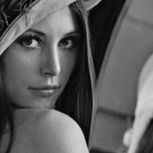
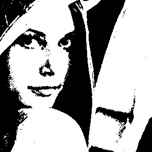
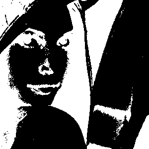
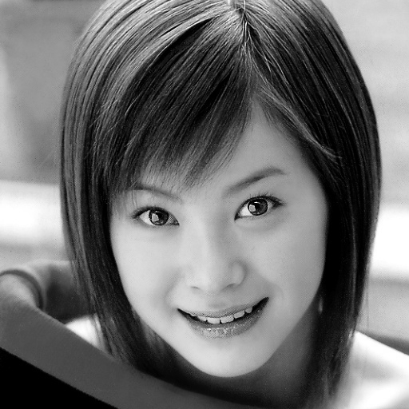
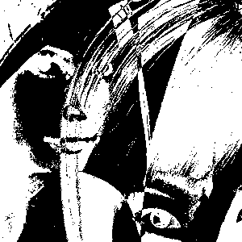

# Image-Processing-cpp
- This project presents a non exhaustive list of image processing algorithms. The algorithms are implemented in C and C++ and all images used are in pgm format.

## Prerequisites

- To follow this tutorial, you need to install the g++ compiler on your PC.
- All examples here are based on a Linux environment but can be easily adapted for Windows based environments.

### Compiling the code
- Clone this repo into your environment and `cd` into the `ImageProcessing` folder:
```
git clone https://github.com/Yuhala/image-processing-cpp.git && cd ImageProcessing

```
Compile the program:

```
sudo g++ main.cpp Image.cpp -o app

```
## How to use the program
- The program presents 26 image processing algorithms. Logic operations, mathematical operations, convolutions and filters, and calculating an image histogram, image luminance, and contrast enhancement algorithms.
- The program can take 3, 4, or 5 arguments, including the name of the binary (`arg 0`). 
- The sample images used are in the `images` folder and are all `.pgm` format.
- The image resulting from each operation is generated in the `output.pgm`
- Below is a list of some of the operations provided by the program and how you can test them on images. 
### Logic Operations (6)
- Image binarization based on Otso's thresholding algorithm: `./app otsuBinarize images/lena.pgm`<br/>
 

- Logic NOT: `./app not images/lena.pgm`<br/>
 

- Logic XOR: `./app images/lena.pgm xor images/aya.pgm`<br/>
 <br/>
 


### Convolution and Filters (9)
- Gauss Filter: `./app gaussFilter images/aya.pgm`
- Laplacien Convolution: `./app laplacienConvo images/lena.pgm`


## Documentation
- A full list of all the implemented algorithms can be found in page 2 of [documentation](image-processing-doc.pdf).
- Enter each operation in camel case when testing, just like in the examples above.

## Authors

* **Peterson Yuhala** 
* petersonyuhala@gmail.com
* Feel free to contact me for more info or to propose fixes.
* P.S: I am not an image processing expert; this was simply a class project :-)


## License

This project is licensed under the MIT License - see the [LICENSE](LICENSE) file for details


